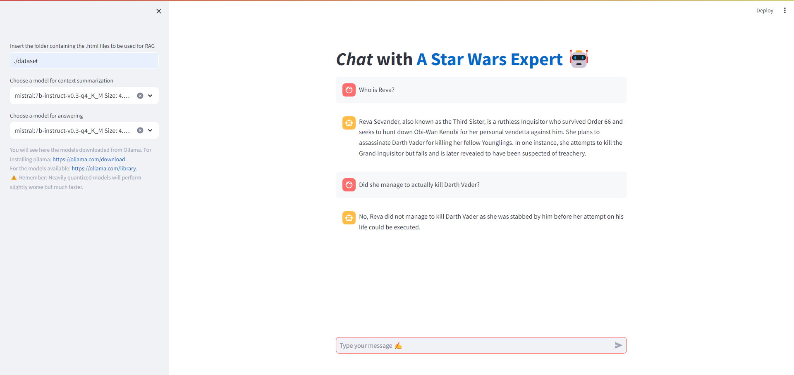
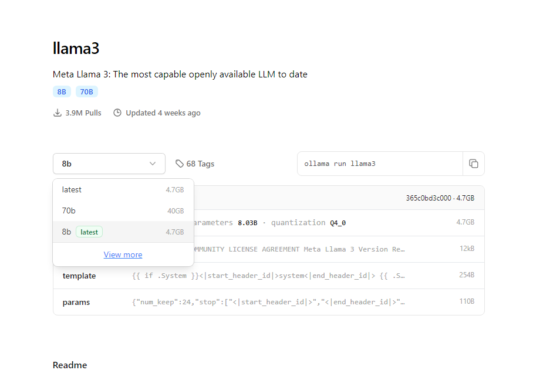

# Conversational RAG Web Interface with Streamlit

This repository contains a conversational Retrieval-Augmented Generation (RAG) web interface developed with Streamlit. The interface allows users to interact with a RAG model by selecting local folders containing data and models for summarization and answering.

<p style="center">
  
</p>

## Features

- **Data Selection:** Users can select the local folder containing the data for RAG.
- **Model Selection:** Users can choose models for chat history summarization and answering.
- **Embedding Creation:** Embeddings are created using the `e5-small-v2` model and cached for faster inference.
- **Vector Index:** FAISS is used as the vector index.
- **HTML Processing:** Inputs are .HTML pages (a sample Star Wars dataset is included). Two chunkers are used: `HTMLSplitter` first and `Recursive Character Splitter` after.
- **LLM Processing:** 
  - One LLM rephrases the history to formulate a unique query that is understandable without the whole chat history.
  - Another LLM answers the query given the rephrased query and the context retrieved from the vector store.

## How to run this repository

#### Clone the repository
First, you need to clone the repository on your local machine and move into the folder.
From terminal, run:
```
git clone https://github.com/AlbertoFormaggio1/conversational_rag_web_interface.git
cd conversational_rag_web_interface
```
#### Install the dependencies in your virtual environment
To execute this environment you need to install the requirements provided in the requirements.txt file.
To install them with Python Virtual Environment, run 
```
pip install -r requirements.txt
```

#### Ollama installation
This project uses Ollama for managing the models.
You can install ollama from here: https://ollama.com/download
The models can be retrieved by running on your terminal:
```
ollama pull "model name"
```

A list of available models can be retrieved at:
https://ollama.com/library
When opening the page of a model, please open the drop-down menu and select a *quantized models* (smaller and faster) that were fine-tuned on instructions (with *instruct* in their name).
From experience, models quantized with Q_4_K_M are a good compromise between quality and speed if you're running your model on a device without GPU.

<p style="center">
  
</p>

#### Running the Application
1. Open the virtual environment with the installed packages.
2. From the project folder, run the following command:
```
streamlit run app.py
```

#### Usage
1. Select the local folder containing the data for RAG.
2. Choose the models for summarization and answering.
3. The interface will process the inputs and provide responses based on the selected models and data.

Before running queries, you need to fill the sidebar on the left! Otherwise, an error will be raised.


#### Sample Dataset
A sample Star Wars dataset is attached to the repository for testing purposes. For more information, look at [this repo](https://github.com/AlbertoFormaggio1/star_wars_unstructured_dataset).
